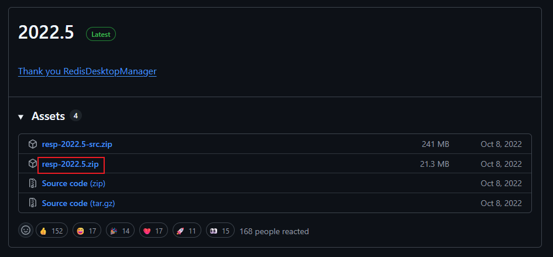
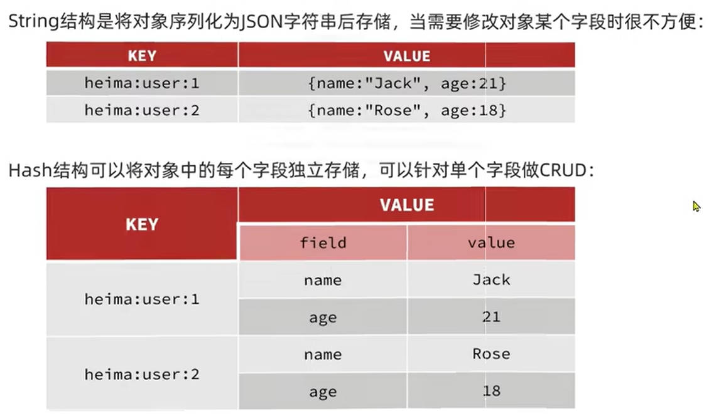
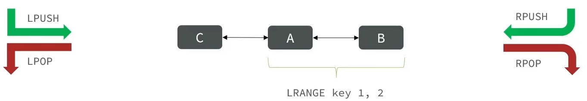
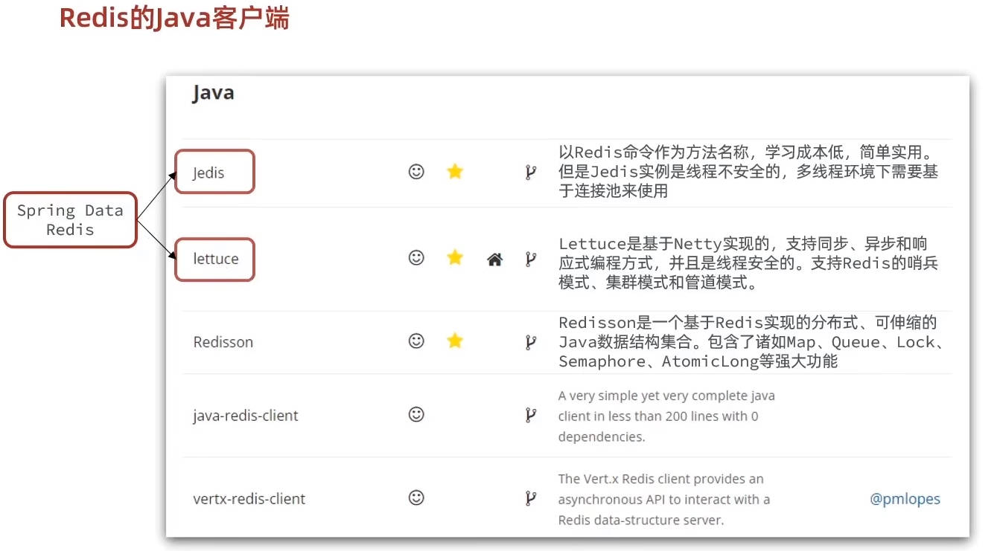
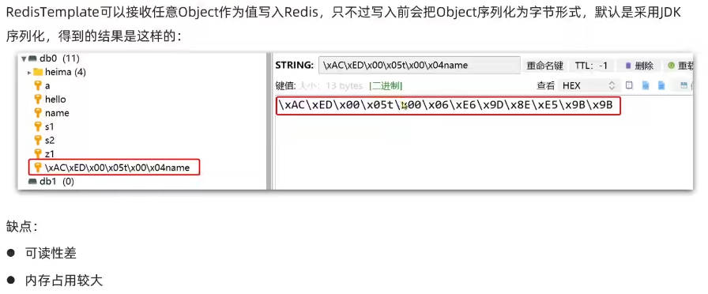
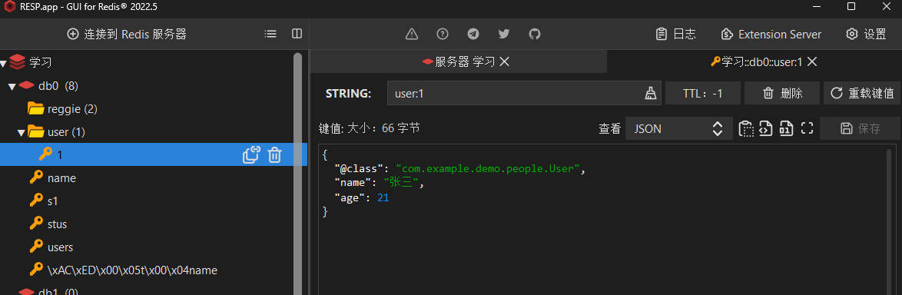
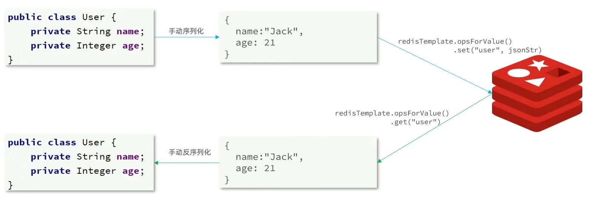
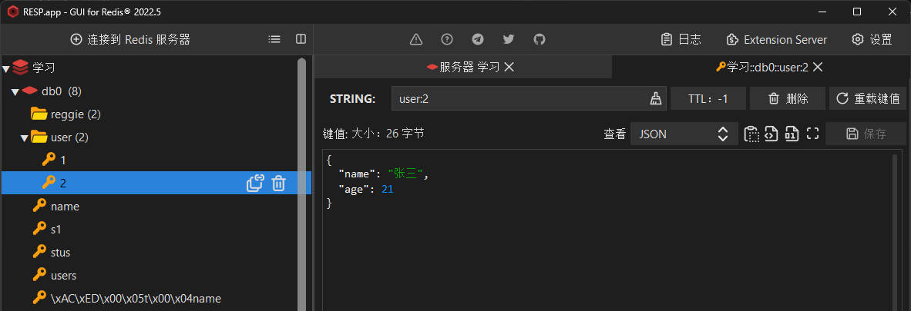
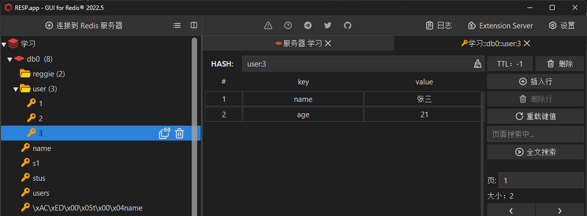

<!-- TOC -->
# 1. 初识Redis
## 1.1 认识NoSQL

**表 1：SQL 与 NoSQL 对比**
| 对比项 | SQL | NoSQL |
| --- | --- | --- |
| 数据结构 | 结构化（Structured） | 非结构化 |
| 数据关联 | 关联的（数据库会帮你维护关系，例如：外键） | 无关联 (数据库不会帮你维护关系，需要程序员自己去维护) |
| 查询方式 | SQL 查询 (不同的数据库命令一样) | 非 SQL (不同的数据库命令不一样) |
| 事务特性 | ACID (原子性、一致性、独立性、持久性)| BASE (无法完全保证ACID) |
| 存储方式 | 磁盘 | 内存 |
| 扩展性 | 垂直扩展 (关系型数据库集群模式一般是主从，主从数据一致，起到数据备份的作用，称为垂直扩展) | 水平扩展 (非关系型数据库可以将数据拆分，存储在不同机器上，可以保存海量数据，解决内存大小有限的问题。称为水平扩展) |
| 使用场景 | 1. 数据结构固定<br>2. 相关业务对数据安全性、一致性要求较高 | 1. 数据结构不固定<br>2. 对一致性、安全性要求不高<br>3. 对性能要求高 |

**表 2：NoSQL非结构化**
| 类型 | 代表数据库 |
| --- | --- |
| 键值型 | Redis |
| 文档型 | MongoDB |
| 列类型 | HBase |
| 图类型 | Neo4j |

## 1.2 认识Redis
Redis诞生于2009年，全称是Remote Dictionary Server远程词典服务器，是一个基于内存的键值型NoSQL数据库。

特征：

- 键值(Key-Value)型，Value支持多种不同的数据结构，功能丰富
- 单线程，每个命令具有原子性
- 低延迟，速度快(基于内存、IO多路复用、良好的编码)
- 支持数据持久化(可以定期把内存数据保存到磁盘.即使 Redis 重启，也能恢复数据)
- 支持主从集群(从节点进行数据备份)、分片集群(将数据拆分，存储在不同机器上，容量和性能可扩展)
- 支持多语言客户端（几乎所有后端语言都能用Redis）

## 1.3 安装Redis
- Windows 版：https://github.com/microsoftarchive/redis/releases
- Linux 版：https://download.redis.io/releases/
注意：最好在 Linux / WSL 环境使用学习redis

以下是Linux / WSL 环境安装Redis的步骤：
1.安装sudo apt install redis-server
```bash
sudo apt install redis-server
```
2.修改配置文件
```bash
sudo -i #在管理员模式才能进行etc目录
sudo vim /etc/redis/redis.conf #修改配置文件里bind、daemonize、requirepass、dir、databases等配置
```
3.开机自启（安装好自己就会开机自启）
4.四个命令
```bash
systemctl start redis #启动Redis服务
systemctl stop redis #停止Redis服务
systemctl restart redis #重启Redis服务
systemctl status redis #查看Redis服务状态
```
## 1.4 Redis桌面客户端
- 命令行客户端
- 图形化桌面客户端
- 编程客户端
### 1.4.1 Redis命令行客户端
Redis安装完成后就自带了命令行客户端：redis-cli，使用方式如下：
```bash
redis-cli [options] [commonds]
```

常见的option有：
- -h 127.0.0.1：指定连接的Redis服务器主机名或IP地址，默认是127.0.0.1
- -p 6379：指定连接的Redis服务器端口号，默认是6379
- -a password：指定连接的Redis服务器密码，默认是没有密码
- -n db：指定连接的Redis数据库编号，默认是0

其中commonds就是Redis的命令，一般不使用这一项，先连接之后再执行命令。
- ping：测试连接是否成功,正常会返回Pong

### 1.4.2 Redis图形化桌面客户端
安装包：https://github.com/lework/RedisDesktopManager-Windows/releases

下载解压缩后，双击运行exe文件进行安装。
进行redis连接即可使用。

# 2. Redis命令
Redis 所有命令可在 [https://redis.io/commands](https://redis.io/commands) 中查询。
命令行查询: help @value的类别
## 2.1 数据结构介绍
Redis是典型的key-value数据库，key一般是字符串，而value包含很多不同的数据类型

| 类型        | 名称     | 示例                          | 分类     |
| ----------- | -------- | ----------------------------- | -------- |
| String      | 字符串   | `hello world`                 | 基本类型 |
| Hash        | 哈希     | `{name:"Jack",age:21}`        | 基本类型 |
| List        | 列表     | `A → B → C → C`               | 基本类型 |
| Set         | 集合     | `{A,B,C}`                     | 基本类型 |
| SortedSet   | 有序集合 | `{A:1,B:2,C:3}`               | 基本类型 |
| GEO         | 地理位置 | `{A:(120.3,30.5)}`            | 特殊类型 |
| BitMap      | 位图     | `0110110101110101011`          | 特殊类型 |
| HyperLogLog | 基数统计 | `0110110101110101011`          | 特殊类型 |

## 2.2 通用命令
```bash
help 命令 #查看用法
keys 通配符 #查找适配的key
del key1 key2 key3 #删除key，若没有key3则只删除key1、key2
exists key #key是否存在，返回1存在，返回0不存在
expire key  time #设置过期时间（s）
ttl key #查看过期时间
```
## 2.3 String类型
String类型，也就是字符串类型，是Redis中最简单的存储类型
其value是字符串，不过根据字符串的格式不同，又可以分为3类
 - string：普通字符串
 - int：整数类型，可以做自增、自减操作
 - float：浮点类型，可以做自增、自减操作

不管是哪种格式，底层都是字节数组形式存储，只不过是编码方式不同，字符串类型的最大空间不能超过512M
```bash
set key value #新增一个键值对 或者覆盖现有这个key
setnx key value #如果不存在key，新增一个键值对，返回增加数
setex key time value #添加值并设置有效期
get key #取值
mset key1 value1 key2 value2 #批量添加键值对
mget key1 key2 #批量获取值，返回一个数组
incr key #整形 value++，返回值是增加后的value
incrby key increment #整形 自增increment（可为负）
incrbyfloat key increment #浮点数 自增increment浮点数
```
## 2.4 Key的层级格式
使用 `项目名:业务名:类型:id` 作为key，也可以使用自己的规则。所有的value类型都可以适用

## 2.5 Hash
Hash类型，也叫散列，其中value是一个无序字典，类似于Java中的HashMap结构

```bash
hset key field value #新增一个键值对 或者覆盖现有这个key
hsetnx key field value #如果不存在则新增，返回增加数
hget key field #取值
hmset key field1 value1 field2 value2 #批量添加
hmget key field1 field2 #批量获取值，返回一个数组
hgetall key #获取所有field和value,返回数组 例如：field1 value1 field1 value2 field2
hkeys key #获取所有的field 返回数组
hvals key #获取所有的value 返回数组
hincrby key field increment #自增increment（可为负）返回自增后的值
```

## 2.6 List
List类型可以看作一个双向链表

```bash
lpush key value1 value2 value3 #从左边添加元素，返回添加后元素的数量
rpush key value1 value2 value3 #从右边添加元素，返回添加后元素的数量
lpop key #从左边弹出一个元素,返回弹出的元素
rpop key #从右边弹出一个元素,返回弹出的元素
lrange key start end #获取范围的元素，start=0 end=-1表示获取所有元素
blpop key timeout #从左边弹出一个元素，timeout是超时时间，单位是秒，返回一个数组，第一个元素是key，第二个元素是value
brpop key timeout #从右边弹出一个元素，timeout是超时时间，单位是秒，返回一个数组，第一个元素是key，第二个元素是value
```

## 2.7 Set
Set类型可以看作是一个hash表，但是value是null
(无序、元素不重复、查找快、支持交集、并集、差集等功能)
```bash
sadd key value1 value2 value3 #添加元素，返回添加元素的数量
srem key value1 value2 #删除元素，返回删除元素的数量
scard key #获取集合的元素数量
sismember key value #判断是否是集合的成员，返回1是，返回0不是
smembers key #获取所有元素
sinter key1 key2 key3 #获取交集,可以多个key,返回一个数组
sdiff key1 key2 key3 #获取差集,key1-key2-key3-...,可以多个key,返回一个数组
sunion key1 key2 key3 #获取并集,可以多个key,返回一个数组
```

## 2.8 SortedSet
SortedSet类型可以看作是可排序的set集合，每个元素都有一个score值通过分数可以对元素进行排序，默认是按照分数升序排序(可排序，元素不重复，查询速度快)，因可排序特性，经常用来实现排行榜这样的功能

```bash
# 添加一个或多个元素到 sorted set（已存在则更新 score）返回添加元素的数量（更新的不计入其中）
ZADD key score member

# 删除 sorted set 中的指定元素
ZREM key member

# 获取 sorted set 中指定元素的 score 值
ZSCORE key member

# 获取 sorted set 中指定元素的排名（从 0 开始，默认升序）
ZRANK key member

# 获取 sorted set 中的元素个数
ZCARD key

# 统计 score 在指定范围内的元素个数[包含min和max]
ZCOUNT key min max

# 让指定元素的 score 自增 increment
ZINCRBY key increment member

# 按 score 排序后，获取指定排名范围内的元素[包含min和max]
ZRANGE key min max

# 按 score 排序后，获取指定 score 范围内的元素[包含min和max]
ZRANGEBYSCORE key min max

# 求差集 / 交集 / 并集
ZDIFF    numkeys key [key ...]
ZINTER   numkeys key [key ...]
ZUNION   numkeys key [key ...]

######################################################################################
##  所有排名（默认升序），如果要降序，则在命令的Z后面添加REV如 ZREVRANGE key start stop  ##
######################################################################################
```

# 3.Redis的Java客户端
在Redis的官网提供了各种语言的客户端，地址为：[https://redis.io/clients](https://redis.io/clients)



## 3.1 Jedis快速入门
Jedis是Redis官方推荐的Java连接开发工具，提供了比较全面的Redis命令的支持。

### 3.1.1 导入Jedis的maven坐标
```xml
<dependency>
    <groupId>redis.clients</groupId>
    <artifactId>jedis</artifactId>
    <version>3.7.0</version>
</dependency>
```

### 3.1.2 连接Redis
```java
private Jedis jedis;

@BeforeEach
void setUp() {
    //1. 建立连接
    jedis = new Jedis("127.0.0.1", 6379);
    //2. 设置密码
    jedis.auth("536536");
    //3. 选择库
    jedis.select(0);
}
```
### 3.1.3 测试连接
```java
@Test
void testString(){
    jedis.set("name","Kyle");
    String name = jedis.get("name");
    System.out.println("name = " + name);
}

@Test
void testHash(){
    jedis.hset("reggie:user:1","name","Jack");
    jedis.hset("reggie:user:2","name","Rose");
    jedis.hset("reggie:user:1","age","21");
    jedis.hset("reggie:user:2","age","18");
    Map<String, String> map = jedis.hgetAll("reggie:user:1");
    System.out.println(map);
}
```

### 3.1.4 关闭连接
```java
@AfterEach
void tearDown() {
    if(jedis != null){
        jedis.close();
    }
}
```

## 3.2 Jedis连接池
- Jedis连接池是一种管理Jedis连接的机制，它可以复用已有的连接，避免每次都创建新的连接，从而提高性能。
- 新建一个util包，用于存放我们编写的工具类JedisConnectionFactory
- 但后面我们使用SpringDataRedis的时候，可以直接在yml配置文件里配置这些内容
```java
public class JedisConnectionFactory {

    private static JedisPool jedisPool;

    static {// 静态代码块，在类加载时执行,最好不要使用静态代码块来初始化，这样没办法销毁jedisPool
        // 配置连接池
        JedisPoolConfig poolConfig = new JedisPoolConfig();
        poolConfig.setMaxTotal(8);
        poolConfig.setMaxIdle(8);
        poolConfig.setMinIdle(0);
        poolConfig.setMaxWaitMillis(1000);
        // 创建连接池对象，参数：连接池配置、服务端ip、服务端端口、超时时间、密码
        jedisPool = new JedisPool(poolConfig, "101.42.225.160", 6379, 1000, "root");
    }

    public static Jedis getJedis(){
        return jedisPool.getResource();
    }
}
```
```java
@SpringBootTest
class RedisTestApplicationTests {

    private Jedis jedis = JedisConnectionFactory.getJedis();

    @Test
    void testString(){
        jedis.set("name","Kyle");
        String name = jedis.get("name");
        System.out.println("name = " + name);
    }

    @Test
    void testHash(){
        jedis.hset("reggie:user:1","name","Jack");
        jedis.hset("reggie:user:2","name","Rose");
        jedis.hset("reggie:user:3","name","Kyle");
        jedis.hset("reggie:user:1","age","21");
        jedis.hset("reggie:user:2","age","18");
        jedis.hset("reggie:user:3","age","18");
        Map<String, String> map = jedis.hgetAll("reggie:user:1");
        System.out.println(map);
    }

    @AfterEach
    void tearDown(){
        if (jedis != null){
            jedis.close();
        }
    }
}
```

## 3.3 认识SpringDataRedis
- SpringData是Spring中数据操作的模块，包含对各种数据库的集成，其中对Redis的集成模块就叫做SpringDataRedis
- 官网地址：[https://spring.io/projects/spring-data-redis](https://spring.io/projects/spring-data-redis)
  - 提供了对不同Redis客户端的整合（Lettuce和Jedis）
  - 提供了RedisTemplate统一API来操作Redis
  - 支持Redis的发布订阅模型
  - 支持Redis哨兵和Redis集群
  - 支持基于Lettuce的响应式编程
  - 支持基于JDK、JSON、字符串、Spring对象的数据序列化及反序列化
  - 支持基于Redis的JDKCollection实现
- SpringDataRedis中提供了RedisTemplate工具类，其中封装了各种对Redis的操作。并且将不同数据类型的操作API封装到了不同的类型中：
  
**表：RedisTemplate 常用 API 对照表**
| API                              | 返回值类型        | 说明                         |
| -------------------------------- | ----------------- | ---------------------------- |
| redisTemplate.opsForValue()      | ValueOperations   | 操作 String 类型数据         |
| redisTemplate.opsForHash()       | HashOperations    | 操作 Hash 类型数据           |
| redisTemplate.opsForList()       | ListOperations    | 操作 List 类型数据           |
| redisTemplate.opsForSet()        | SetOperations     | 操作 Set 类型数据            |
| redisTemplate.opsForZSet()       | ZSetOperations    | 操作 SortedSet 类型数据      |
| redisTemplate                   | ——                | 通用的 Redis 命令操作        |

## 3.3 RedisTemplate快速入门
### 3.3.1 导入依赖
```xml
<!--redis依赖-->
<dependency>
    <groupId>org.springframework.boot</groupId>
    <artifactId>spring-boot-starter-data-redis</artifactId>
</dependency>
<!--common-pool-->
<dependency>
    <groupId>org.apache.commons</groupId>
    <artifactId>commons-pool2</artifactId>
</dependency>
```
### 3.3.2 配置Redis
```xml
spring:
  data:
    redis:
      host: 127.0.0.1
      port: 6379
      password: 536536
      lettuce: # spring默认使用lettuce连接池，若使用jedis则需要在pom文件额外引入jedis相关依赖
        pool:
          max-active: 8
          max-idle: 8
          min-idle: 0
          max-wait: 1000ms
```
### 3.3.3 注入RedisTemplate
```java
@Autowired
	private RedisTemplate redisTemplate;
	// Spring Boot 默认只提供这下面这两个 Bean：
	// RedisTemplate 即 RedisTemplate<Object, Object>
	// StringRedisTemplate 即 RedisTemplate<String, String>
    //注意:对于object的对象，spring底层默认使用jdk序列化和反序列化，存入redis的key或value时会使用序列化后的字节数组
```

`3.4将会介绍如何解决这种问题`
### 3.3.4 编写测试方法
```java
@Test
void testRedisTemplate(){
	redisTemplate.opsForValue().set("name","李四");
	Object name = redisTemplate.opsForValue().get("name");
	System.out.println("name = " + name);
}
```

## 3.4 RedisTemplate的RedisSerializer(第一种使用方案)
- RedisSerializer是RedisTemplate的序列化器，用于将对象序列化为字节数组，存入redis的key或value时会使用序列化后的字节数组
- Spring Boot 默认使用jdk序列化和反序列化，存入redis的key或value时会使用序列化后的字节数组
- 为了解决此问题，我们需要自定义RedisTemplate<String, Object>，key会使用String序列化，value会使用json序列化
### 3.4.1 引入依赖
```xml
<!--Jackson依赖-->
<!--json序列化反序列化使用-->
<dependency>
	<groupId>com.fasterxml.jackson.core</groupId>
	<artifactId>jackson-databind</artifactId>
</dependency>
```
### 3.4.2 配置RedisSerializer
在config文件下加一个RedisConfig类
```java
@Configuration
public class RedisConfig {

    @Bean
    public RedisTemplate<String, Object> redisTemplate(RedisConnectionFactory connectionFactory) {
        // 创建RedisTemplate对象
        RedisTemplate<String, Object> template = new RedisTemplate<>();
        // 设置连接工厂
        template.setConnectionFactory(connectionFactory);
        // 创建JSON序列化工具
        GenericJackson2JsonRedisSerializer jsonRedisSerializer =
                new GenericJackson2JsonRedisSerializer();
        // 设置Key的序列化
        template.setKeySerializer(RedisSerializer.string());
        template.setHashKeySerializer(RedisSerializer.string());
        // 设置Value的序列化
        template.setValueSerializer(jsonRedisSerializer);
        template.setHashValueSerializer(jsonRedisSerializer);
        // 返回
        return template;
    }
}
```
### 3.4.3 编写User类
```java
package com.example.demo.people;

import lombok.AllArgsConstructor;
import lombok.Data;
import lombok.NoArgsConstructor;

@Data
@NoArgsConstructor
@AllArgsConstructor
public class User {
    private String name;
    private Integer age;
}
```

### 3.4.4 编写测试方法
```java
@Autowired
private RedisTemplate<String, Object> redisTemplate1;//使用注入的bean
@Test
void testRedisTemplateUser(){
	redisTemplate1.opsForValue().set("user:1",new User("张三", 21));
	User o = (User) redisTemplate1.opsForValue().get("user:1");
	System.out.println("o = " + o);
}
```
redis存储结果：


## 3.5 StringRedisTemplate手动进行序列化和反序列化(第二种使用方案)



### 3.5.1 实现
```java
@Autowired
private StringRedisTemplate stringRedisTemplate;

private static final ObjectMapper mapper = new ObjectMapper();//JSON序列化工具

@Test
void testRedisTemplateUser() throws JsonProcessingException {

	//创建对象
	User user = new User("张三", 21);
	//手动序列化
	String json = mapper.writeValueAsString(user);
	//写入数据
	stringRedisTemplate.opsForValue().set("user:2",json);
	//拿到数据
	String jsonUser = stringRedisTemplate.opsForValue().get("user:2");
	//手动反序列化
	User user2 = mapper.readValue(jsonUser, User.class);

	System.out.println("user2 = " + user2);
}
```
redis存储结果：

`可以对比3.4的结果，大大节省了存储空间`

### 3.5.3 Hash使用StringRedisTemplate
```java
@Test
void testHash(){
	stringRedisTemplate.opsForHash().put("user:3","name","张三");
	stringRedisTemplate.opsForHash().put("user:3","age","21");
	//拿到数据
	Map<Object, Object> map = stringRedisTemplate.opsForHash().entries("user:3");
	System.out.println("map = " + map);
}
```
redis存储结果：

