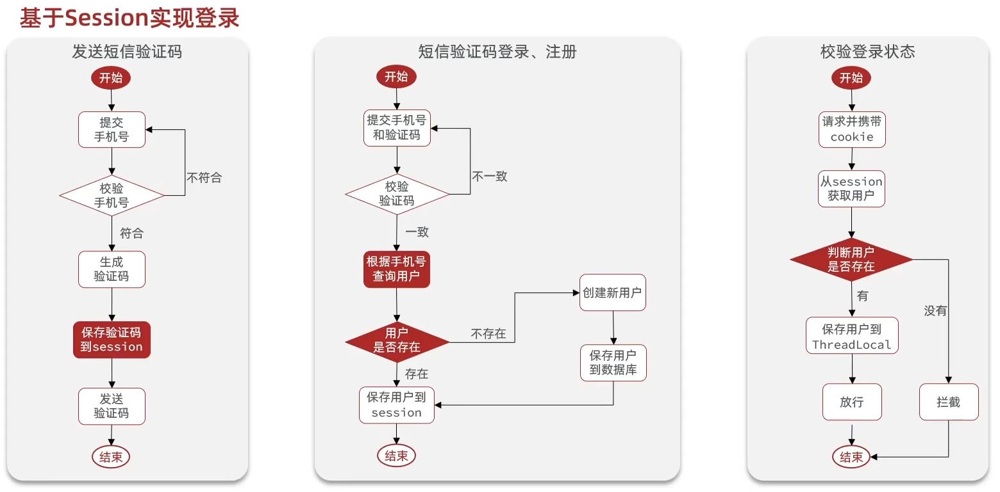
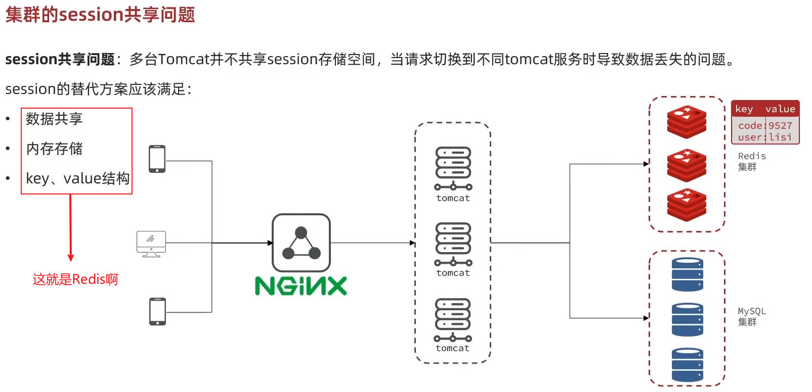
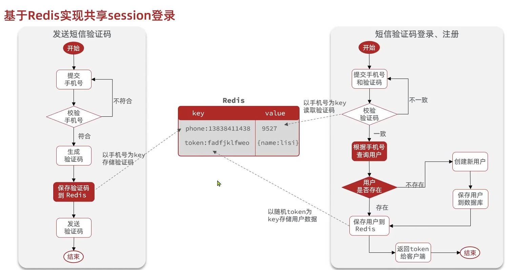
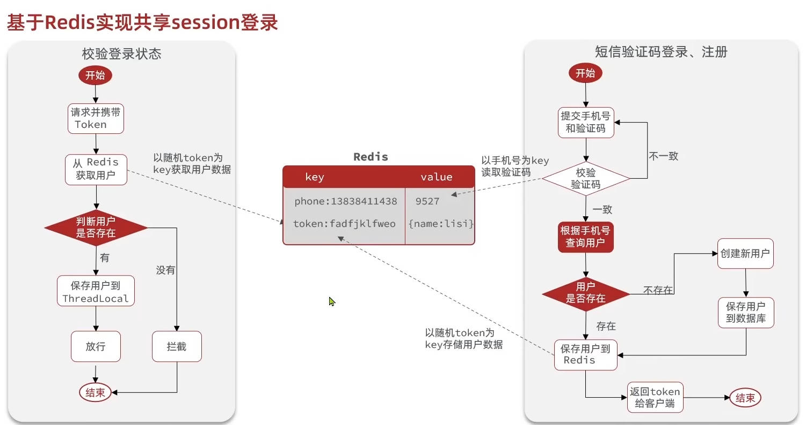
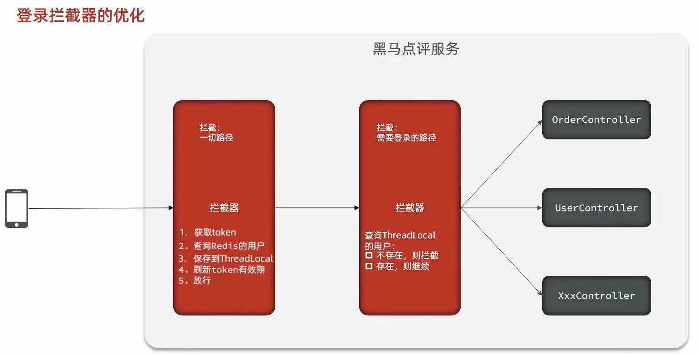

# Redis实战
## 1. 短信登录
### 1.1 导入黑马点评项目
导入项目就不介绍了，可以观看下面的视频：
黑马程序员Redis入门到实战教程，深度透析redis底层原理+redis分布式锁+企业解决方案+黑马点评实战项目:[https://www.bilibili.com/video/BV1cr4y1671t](https://www.bilibili.com/video/BV1cr4y1671t)

### 1.2 基于Session实现登录
#### 1.2.1 发送短信验证码
发送短信验证码:
```java
@Override
public Result sendCode(String phone, HttpSession session) {
    // 1.校验手机号
    if (RegexUtils.isPhoneInvalid(phone)) {
        // 2.如果不符合
        return Result.fail("手机号格式错误!");
    }
    // 3.如果符合，生成验证码
    String code = RandomUtil.randomNumbers(6);
    // 4.保存验证码到session
    session.setAttribute("code", code);
    // 5.发送验证码
    log.debug("发送短信验证码成功，验证码：{}", code);
    // 返回ok
    return Result.ok();
}
```
#### 1.2.2 短信验证码登录注册
登录注册实现:
```java
@Override
public Result login(LoginFormDTO loginForm, HttpSession session) {
    // 1.校验手机号
    String phone = loginForm.getPhone();
    if (RegexUtils.isPhoneInvalid(phone)) {
        // 2.如果不符合
        return Result.fail("手机号格式错误!");
    }
    // 2.校验验证码
    Object cacheCode = session.getAttribute("code");
    String code = loginForm.getCode();
    if (cacheCode == null || !cacheCode.toString().equals(code)) {
        // 3.不一致报错
        return Result.fail("验证码错误!");
    }
    
    // 4.一致，根据手机号查询用户 select * from tb_user where phone = ?
    User user = query()//当前UserServiceImpl类里自带的，因为它继承自ServiceImpl，ServiceImpl由MyBatisPlus提供，可以帮我们实现单表的增删改查
        .eq("phone", phone)//相当于where phone = ?
        .one();
    
    // 5.判断用户是否存在
    if (user == null) {
        log.debug("用户{}不存在，创建新用户", phone);
        // 6.不存在，创建新用户并保存
        user = createUserWithPhone(phone);
    }
    log.debug("用户{}", user);
    // 7.保存用户信息到session中
    session.setAttribute("user", BeanUtil.copyProperties(user, UserDTO.class));
    return Result.ok();
}
```
创建用户方法:
```java
private User createUserWithPhone(String phone) {
    // 创建用户
    User user = new User();
    user.setPhone(phone);
    user.setNickName(USER_NICK_NAME_PREFIX + RandomUtil.randomString(10));
    // 保存用户
    save(user);//由MyBatisPlus提供
    return user;
}
```

#### 1.2.3 校验登录状态
校验登录状态类:
```java
@Slf4j
public class LoginInterceptor implements HandlerInterceptor {

    @Override
    public void afterCompletion(HttpServletRequest request, HttpServletResponse response, Object handler, Exception ex)
            throws Exception {
        // 移除用户
        UserHolder.removeUser();//登录拦截器结束时，移除用户信息，避免内存泄漏。每个移除都在自己的ThreadLocal，互不干扰
        //UserHolder 本质是一个 ThreadLocal 容器，同一个 HTTP 请求在同一个线程中执行
        
    }

    @Override
    public boolean preHandle(HttpServletRequest request, HttpServletResponse response, Object handler)
            throws Exception {
        log.debug("LoginInterceptor开始拦截");
        // 1.获取session
        HttpSession session = request.getSession();
        // 2.获取seesion中的用户
        Object user = session.getAttribute("user");
        // 3.判断用户是否存在
        if (user == null) {
            // 4.如果不存在，拦截
            log.debug("LoginInterceptor开始拦截-用户未登录");
            response.setStatus(HttpServletResponse.SC_UNAUTHORIZED);
            return false;
        }

        // 5.存在，保存用户信息到ThreadLocal
        UserHolder.saveUser((UserDTO) user);
        log.debug("LoginInterceptor开始拦截-用户已登录：{}", user);

        //放行
        return true;
    }

    
}
```
新增一个配置类MvcConfig，配置登录拦截器（使用LoginInterceptor类实例）:
```java
@Configuration
public class MvcConfig implements WebMvcConfigurer {

    @Override
    public void addInterceptors(InterceptorRegistry registry) {
        // 登录拦截器
        registry.addInterceptor(new LoginInterceptor())
                .excludePathPatterns(
                        "/shop/**",
                        "/voucher/**",
                        "/shop-type/**",
                        "/blog/hot",
                        "/user/code",
                        "/user/login"
                );
    }

}
```
### 1.3 集群的session共享问题

### 1.4 基于Redis实现共享session登录


#### 1.4.1 发送短信验证码
发送短信验证码:
```java
@Override
public Result sendCode(String phone, HttpSession session) {
    // 1.校验手机号
    if (RegexUtils.isPhoneInvalid(phone)) {
        // 2.如果不符合
        return Result.fail("手机号格式错误!");
    }
    // 3.如果符合，生成验证码
    String code = RandomUtil.randomNumbers(6);
    // 4.保存验证码到redis
    stringRedisTemplate.opsForValue().set(LOGIN_CODE_KEY + phone, code, LOGIN_CODE_TTL, TimeUnit.MINUTES);
    // 5.发送验证码
    log.debug("发送短信验证码成功，验证码：{}", code);
    // 返回ok
    return Result.ok();
}
```
#### 1.4.2 短信验证码登录注册
登录注册实现:
```java
@Override
public Result login(LoginFormDTO loginForm, HttpSession session) {
    // 1.校验手机号
    String phone = loginForm.getPhone();
    if (RegexUtils.isPhoneInvalid(phone)) {
        // 2.如果不符合
        return Result.fail("手机号格式错误!");
    }
    // 3.从redis获取验证码并校验
    String cacheCode = stringRedisTemplate.opsForValue().get(LOGIN_CODE_KEY + phone);
    String code = loginForm.getCode();
    if (cacheCode == null || !cacheCode.equals(code)) {
        // 不一致报错
        return Result.fail("验证码错误!");
    }
    
    // 4.一致，根据手机号查询用户 select * from tb_user where phone = ?
    User user = query()//当前UserServiceImpl类里自带的，因为它继承自ServiceImpl，ServiceImpl由MyBatisPlus提供，可以帮我们实现单表的增删改查
        .eq("phone", phone)//相当于where phone = ?
        .one();
    
    // 5.判断用户是否存在
    if (user == null) {
        log.debug("用户{}不存在，创建新用户", phone);
        // 6.不存在，创建新用户并保存
        user = createUserWithPhone(phone);
    }
    log.debug("用户{}", user);
    // 7.保存用户信息到redis中
    // 7.1.随机生成token，作为登录令牌
    String token = UUID.randomUUID().toString(true);
    // 7.2.将User对象转为HashMap存储
    UserDTO userDTO = BeanUtil.copyProperties(user, UserDTO.class);
    Map<String, Object> userMap = BeanUtil.beanToMap(userDTO, new HashMap<>(),
            CopyOptions.create()
                .setIgnoreNullValue(true)
                .setFieldValueEditor((fieldName, fieldValue) -> fieldValue.toString()));
                //.setIgnoreNullValue(true)用来忽略null值的字段
                //.setFieldValueEditor((fieldName, fieldValue) -> fieldValue.toString())其中(fieldName, fieldValue)是(字段名，字段值)，返回fieldValue.toString()作为最终值
    // 7.3.存储到redis中
    stringRedisTemplate.opsForHash().putAll(LOGIN_USER_KEY + token, userMap);
    // 7.4.设置token有效期
    stringRedisTemplate.expire(LOGIN_USER_KEY + token, LOGIN_USER_TTL, TimeUnit.MINUTES);
    
    // 8.返回token
    return Result.ok(token);
}
```
创建用户方法:
```java
private User createUserWithPhone(String phone) {
    // 创建用户
    User user = new User();
    user.setPhone(phone);
    user.setNickName(USER_NICK_NAME_PREFIX + RandomUtil.randomString(10));
    // 保存用户
    save(user);//由MyBatisPlus提供
    return user;
}
```

#### 1.4.3 校验登录状态
校验登录状态类:
```java
@Slf4j
public class LoginInterceptor implements HandlerInterceptor {

    // 不能使用@Resource注解，因为LoginInterceptor不是spring容器管理的bean，他是我们自己new出来的
    // private StringRedisTemplate stringRedisTemplate;
    private StringRedisTemplate stringRedisTemplate;

    // 构造函数注入stringRedisTemplate
    public LoginInterceptor(StringRedisTemplate stringRedisTemplate) {
        this.stringRedisTemplate = stringRedisTemplate;
    }

    @Override
    public void afterCompletion(HttpServletRequest request, HttpServletResponse response, Object handler, Exception ex)
            throws Exception {
        // 移除用户
        UserHolder.removeUser();//拦截器结束时，移除用户信息，避免内存泄漏。每个移除都在自己的ThreadLocal，互不干扰
        //UserHolder 本质是一个 ThreadLocal 容器，同一个 HTTP 请求在同一个线程中执行
        
    }

    @Override
    public boolean preHandle(HttpServletRequest request, HttpServletResponse response, Object handler)
            throws Exception {
        log.debug("LoginInterceptor开始拦截");
        // 1.获取请求头中的token
        String token = request.getHeader("authorization");
        if (StrUtil.isBlank(token)) {
            // 2.如果token不存在，拦截
            log.debug("LoginInterceptor开始拦截-用户未登录");
            response.setStatus(HttpServletResponse.SC_UNAUTHORIZED);
            return false;
        }

        // 2.基于token获取redis中的用户
        String key = LOGIN_USER_KEY + token;
        Map<Object, Object> userMap = stringRedisTemplate.opsForHash().entries(key);
        // 3.判断用户是否存在
        if (userMap.isEmpty()) {
            // 4.如果不存在，拦截
            log.debug("LoginInterceptor开始拦截-用户未登录");
            response.setStatus(HttpServletResponse.SC_UNAUTHORIZED);
            return false;
        }
        // 5.如果存在，将用户信息转换为UserDTO对象
        UserDTO userDTO = BeanUtil.fillBeanWithMap(userMap, new UserDTO(), false);
        // 6.存在，保存用户信息到ThreadLocal
        UserHolder.saveUser(userDTO);
        log.debug("LoginInterceptor开始拦截-用户已登录：{}", userDTO);
        // 7.刷新token有效期
        stringRedisTemplate.expire(key, LOGIN_USER_TTL, TimeUnit.MINUTES);
        //放行
        return true;
    }
}
```
新增一个配置类MvcConfig，配置登录拦截器（使用LoginInterceptor类实例）:
```java
@Configuration
public class MvcConfig implements WebMvcConfigurer {

    @Resource
    private StringRedisTemplate stringRedisTemplate;

    @Override
    public void addInterceptors(InterceptorRegistry registry) {
        // 登录拦截器
        registry.addInterceptor(new LoginInterceptor(stringRedisTemplate))//使用LoginInterceptor类实例，传入stringRedisTemplate参数
                .excludePathPatterns(
                        "/shop/**",
                        "/voucher/**",
                        "/shop-type/**",
                        "/blog/hot",
                        "/user/code",
                        "/user/login"
                );
    }

}
```
#### 1.4.4 Redis代替session需要考虑的问题
- 选择合适的数据结构
  (简单数据如验证码完全可以用String存储。复杂数据对象类型如用户信息可以用Hash存储，存储空间占用更小，可以对单个字段进行修改，灵活。)
- 选择合适的key
  (唯一性、更方便的找到它取数据)
- 合适的有效期，避免过多占用内存
- 选择合适的存储粒度
  (根据业务场景选择合适的存储粒度，可以只保存页面需要的不太敏感的数据，同时节省内存空间)

### 1.5 解决状态登录刷新问题
- 之前是只有登录才能访问的页面进行访问时才会刷新token过期时间
- 现在新增一个拦截器对所有页面的访问都会进行刷新token过期时间


新增RefreshTokenInterceptor拦截器类，只做刷新token过期时间，不做拦截:
```java
@Slf4j
public class RefreshTokenInterceptor implements HandlerInterceptor {

    // 不能使用@Resource注解，因为LoginInterceptor不是spring容器管理的bean，他是我们自己new出来的
    // private StringRedisTemplate stringRedisTemplate;
    private StringRedisTemplate stringRedisTemplate;

    // 构造函数注入stringRedisTemplate
    public RefreshTokenInterceptor(StringRedisTemplate stringRedisTemplate) {
        this.stringRedisTemplate = stringRedisTemplate;
    }

    @Override
    public void afterCompletion(HttpServletRequest request, HttpServletResponse response, Object handler, Exception ex)
            throws Exception {
        // 移除用户
        UserHolder.removeUser();//拦截器结束时，移除用户信息，避免内存泄漏。每个移除都在自己的ThreadLocal，互不干扰
        //UserHolder 本质是一个 ThreadLocal 容器，同一个 HTTP 请求在同一个线程中执行
        
    }

    @Override
    public boolean preHandle(HttpServletRequest request, HttpServletResponse response, Object handler)
            throws Exception {
        log.debug("LoginInterceptor开始拦截");
        // 1.获取请求头中的token
        String token = request.getHeader("authorization");
        if (StrUtil.isBlank(token)) {
            return true;
        }

        // 2.基于token获取redis中的用户
        String key = LOGIN_USER_KEY + token;
        Map<Object, Object> userMap = stringRedisTemplate.opsForHash().entries(key);
        // 3.判断用户是否存在
        if (userMap.isEmpty()) {
            return true;
        }
        // 5.如果存在，将用户信息转换为UserDTO对象
        UserDTO userDTO = BeanUtil.fillBeanWithMap(userMap, new UserDTO(), false);
        // 6.存在，保存用户信息到ThreadLocal
        UserHolder.saveUser(userDTO);
        log.debug("LoginInterceptor开始拦截-用户已登录：{}", userDTO);
        // 7.刷新token有效期
        stringRedisTemplate.expire(key, LOGIN_USER_TTL, TimeUnit.MINUTES);
        //放行
        return true;
    }
}
```
修改原本的拦截器LoginInterceptor只做登录拦截，不刷新token过期时间
```java
public class LoginInterceptor implements HandlerInterceptor {

    @Override
    public boolean preHandle(HttpServletRequest request, HttpServletResponse response, Object handler)
            throws Exception {
        // 1.判断是否需要拦截（ThreadLocal中是否有用户）
        if(UserHolder.getUser() == null){
            // 如果不存在，拦截
            response.setStatus(HttpServletResponse.SC_UNAUTHORIZED);
            return false;
        }
        //有用户，放行
        return true;
    }
}
```
配置类MvcConfig新增一个拦截器并设置拦截顺序，先刷新token过期时间，再登录拦截:
```java
@Configuration
public class MvcConfig implements WebMvcConfigurer {

    @Resource
    private StringRedisTemplate stringRedisTemplate;

    @Override
    public void addInterceptors(InterceptorRegistry registry) {
        // 登录拦截器
        registry.addInterceptor(new LoginInterceptor())//使用LoginInterceptor类实例，传入stringRedisTemplate参数
                .excludePathPatterns(
                        "/shop/**",
                        "/voucher/**",
                        "/shop-type/**",
                        "/blog/hot",
                        "/user/code",
                        "/user/login"
                ).order(1);//设置拦截器的执行顺序，数字越小优先级越高
        //刷新token拦截器
        registry.addInterceptor(new RefreshTokenInterceptor(stringRedisTemplate)).addPathPatterns("/**").order(0);//设置拦截器的执行顺序，数字越小优先级越高
    }

}
```
拦截器执行顺序（可以看作是栈的入栈出栈过程）：
```text
Tomcat 线程
   ↓
RefreshTokenInterceptor拦截器 1（preHandle）//刷新token过期时间，存入ThreadLocal用户信息
   ↓
LoginInterceptor拦截器 2（preHandle）//登录拦截，判断是否需要拦截（ThreadLocal中是否有用户）
   ↓
Controller
   ↓
LoginInterceptor拦截器 2（afterCompletion）//结束拦截器2
   ↓
RefreshTokenInterceptor拦截器 1（afterCompletion）//结束拦截器1，移除ThreadLocal中的信息，避免内存泄漏
```


