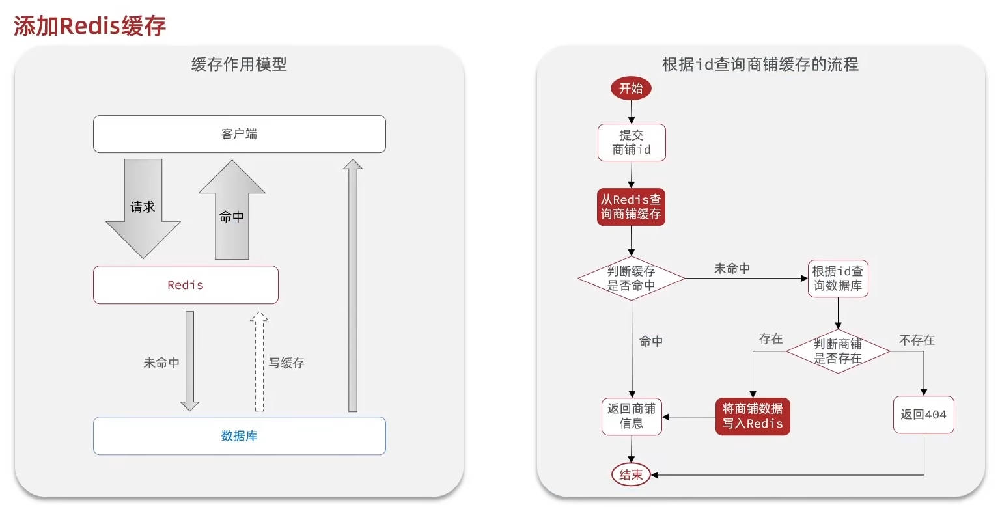
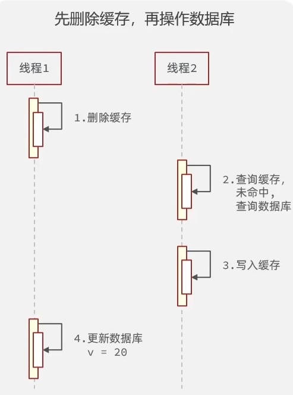
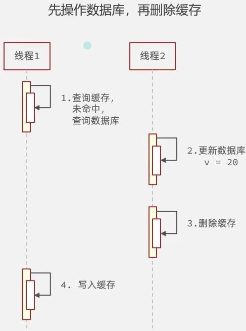
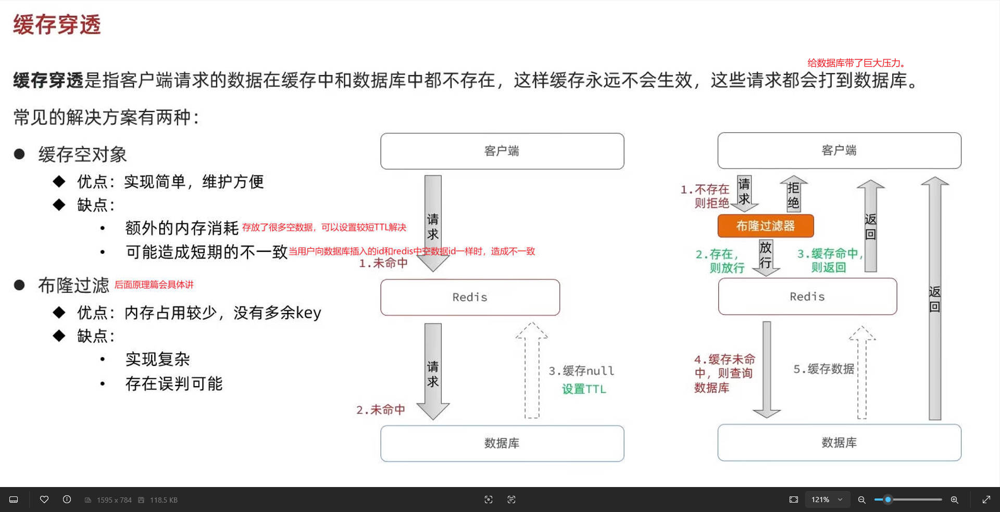
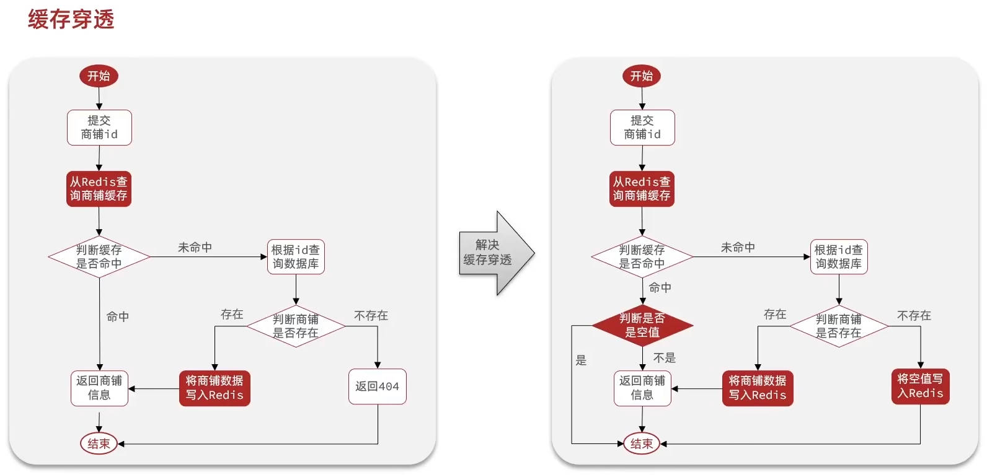
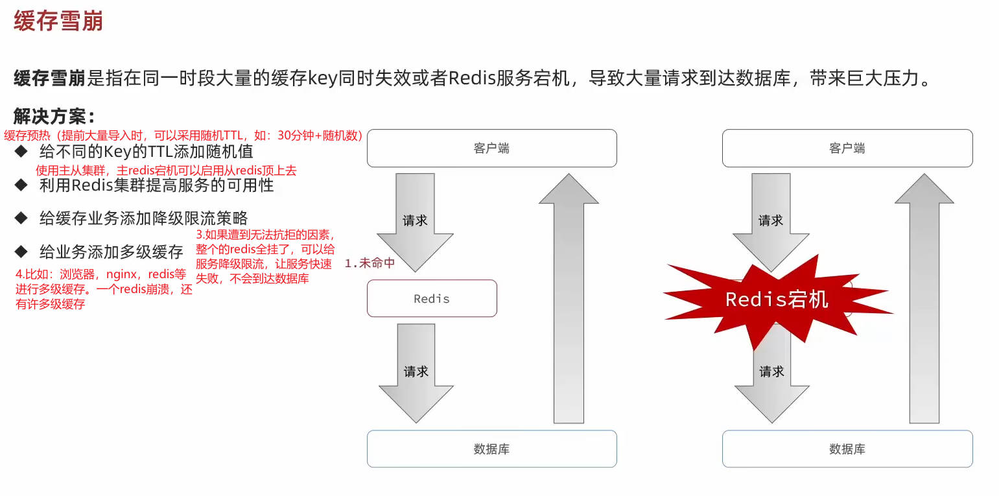
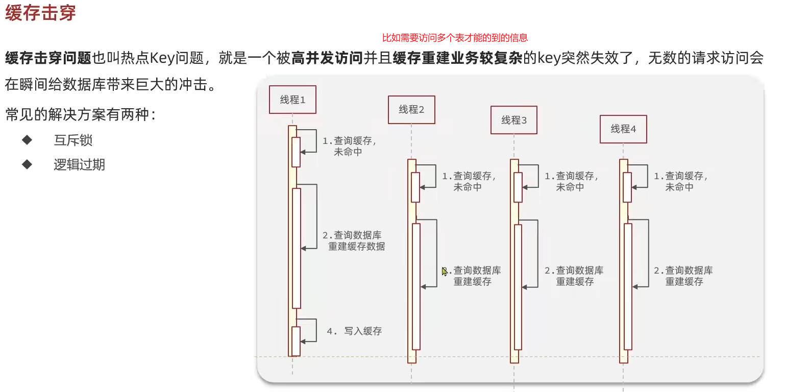
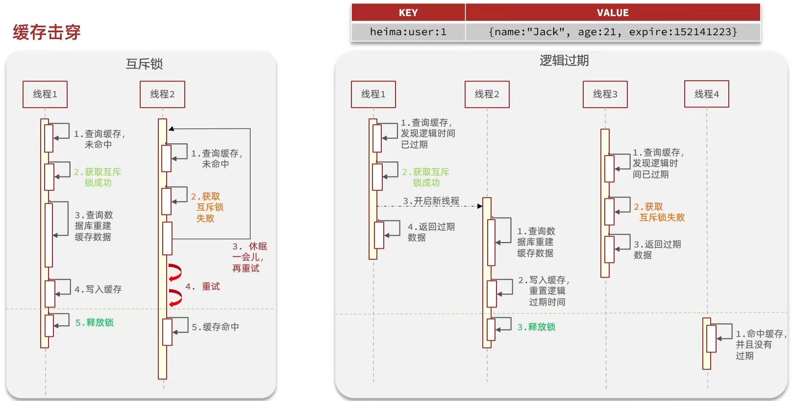
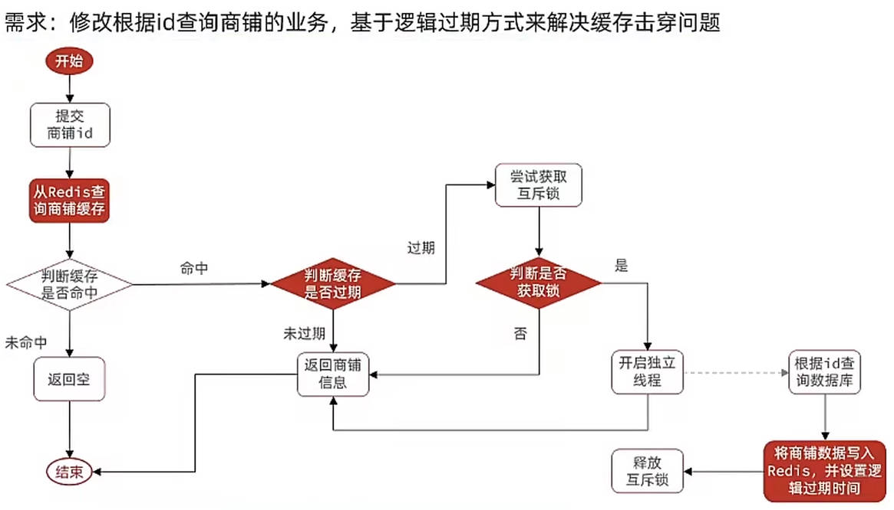

<font size="24">Redis实战</font>
## 1. 短信登录
### 1.1 导入黑马点评项目
导入项目就不介绍了，可以观看下面的视频：
黑马程序员Redis入门到实战教程，深度透析redis底层原理+redis分布式锁+企业解决方案+黑马点评实战项目:[https://www.bilibili.com/video/BV1cr4y1671t](https://www.bilibili.com/video/BV1cr4y1671t)

### 1.2 基于Session实现登录
#### 1.2.1 发送短信验证码
发送短信验证码:
```java
@Override
public Result sendCode(String phone, HttpSession session) {
    // 1.校验手机号
    if (RegexUtils.isPhoneInvalid(phone)) {
        // 2.如果不符合
        return Result.fail("手机号格式错误!");
    }
    // 3.如果符合，生成验证码
    String code = RandomUtil.randomNumbers(6);
    // 4.保存验证码到session
    session.setAttribute("code", code);
    // 5.发送验证码
    log.debug("发送短信验证码成功，验证码：{}", code);
    // 返回ok
    return Result.ok();
}
```
#### 1.2.2 短信验证码登录注册
登录注册实现:
```java
@Override
public Result login(LoginFormDTO loginForm, HttpSession session) {
    // 1.校验手机号
    String phone = loginForm.getPhone();
    if (RegexUtils.isPhoneInvalid(phone)) {
        // 2.如果不符合
        return Result.fail("手机号格式错误!");
    }
    // 2.校验验证码
    Object cacheCode = session.getAttribute("code");
    String code = loginForm.getCode();
    if (cacheCode == null || !cacheCode.toString().equals(code)) {
        // 3.不一致报错
        return Result.fail("验证码错误!");
    }
    
    // 4.一致，根据手机号查询用户 select * from tb_user where phone = ?
    User user = query()//当前UserServiceImpl类里自带的，因为它继承自ServiceImpl，ServiceImpl由MyBatisPlus提供，可以帮我们实现单表的增删改查
        .eq("phone", phone)//相当于where phone = ?
        .one();
    
    // 5.判断用户是否存在
    if (user == null) {
        log.debug("用户{}不存在，创建新用户", phone);
        // 6.不存在，创建新用户并保存
        user = createUserWithPhone(phone);
    }
    log.debug("用户{}", user);
    // 7.保存用户信息到session中
    session.setAttribute("user", BeanUtil.copyProperties(user, UserDTO.class));
    return Result.ok();
}
```
创建用户方法:
```java
private User createUserWithPhone(String phone) {
    // 创建用户
    User user = new User();
    user.setPhone(phone);
    user.setNickName(USER_NICK_NAME_PREFIX + RandomUtil.randomString(10));
    // 保存用户
    save(user);//由MyBatisPlus提供
    return user;
}
```

#### 1.2.3 校验登录状态
校验登录状态类:
```java
@Slf4j
public class LoginInterceptor implements HandlerInterceptor {

    @Override
    public void afterCompletion(HttpServletRequest request, HttpServletResponse response, Object handler, Exception ex)
            throws Exception {
        // 移除用户
        UserHolder.removeUser();//登录拦截器结束时，移除用户信息，避免内存泄漏。每个移除都在自己的ThreadLocal，互不干扰
        //UserHolder 本质是一个 ThreadLocal 容器，同一个 HTTP 请求在同一个线程中执行
        
    }

    @Override
    public boolean preHandle(HttpServletRequest request, HttpServletResponse response, Object handler)
            throws Exception {
        log.debug("LoginInterceptor开始拦截");
        // 1.获取session
        HttpSession session = request.getSession();
        // 2.获取seesion中的用户
        Object user = session.getAttribute("user");
        // 3.判断用户是否存在
        if (user == null) {
            // 4.如果不存在，拦截
            log.debug("LoginInterceptor开始拦截-用户未登录");
            response.setStatus(HttpServletResponse.SC_UNAUTHORIZED);
            return false;
        }

        // 5.存在，保存用户信息到ThreadLocal
        UserHolder.saveUser((UserDTO) user);
        log.debug("LoginInterceptor开始拦截-用户已登录：{}", user);

        //放行
        return true;
    }

    
}
```
新增一个配置类MvcConfig，配置登录拦截器（使用LoginInterceptor类实例）:
```java
@Configuration
public class MvcConfig implements WebMvcConfigurer {

    @Override
    public void addInterceptors(InterceptorRegistry registry) {
        // 登录拦截器
        registry.addInterceptor(new LoginInterceptor())
                .excludePathPatterns(
                        "/shop/**",
                        "/voucher/**",
                        "/shop-type/**",
                        "/blog/hot",
                        "/user/code",
                        "/user/login"
                );
    }

}
```
### 1.3 集群的session共享问题

### 1.4 基于Redis实现共享session登录


#### 1.4.1 发送短信验证码
发送短信验证码:
```java
@Override
public Result sendCode(String phone, HttpSession session) {
    // 1.校验手机号
    if (RegexUtils.isPhoneInvalid(phone)) {
        // 2.如果不符合
        return Result.fail("手机号格式错误!");
    }
    // 3.如果符合，生成验证码
    String code = RandomUtil.randomNumbers(6);
    // 4.保存验证码到redis
    stringRedisTemplate.opsForValue().set(LOGIN_CODE_KEY + phone, code, LOGIN_CODE_TTL, TimeUnit.MINUTES);
    // 5.发送验证码
    log.debug("发送短信验证码成功，验证码：{}", code);
    // 返回ok
    return Result.ok();
}
```
#### 1.4.2 短信验证码登录注册
登录注册实现:
```java
@Override
public Result login(LoginFormDTO loginForm, HttpSession session) {
    // 1.校验手机号
    String phone = loginForm.getPhone();
    if (RegexUtils.isPhoneInvalid(phone)) {
        // 2.如果不符合
        return Result.fail("手机号格式错误!");
    }
    // 3.从redis获取验证码并校验
    String cacheCode = stringRedisTemplate.opsForValue().get(LOGIN_CODE_KEY + phone);
    String code = loginForm.getCode();
    if (cacheCode == null || !cacheCode.equals(code)) {
        // 不一致报错
        return Result.fail("验证码错误!");
    }
    
    // 4.一致，根据手机号查询用户 select * from tb_user where phone = ?
    User user = query()//当前UserServiceImpl类里自带的，因为它继承自ServiceImpl，ServiceImpl由MyBatisPlus提供，可以帮我们实现单表的增删改查
        .eq("phone", phone)//相当于where phone = ?
        .one();
    
    // 5.判断用户是否存在
    if (user == null) {
        log.debug("用户{}不存在，创建新用户", phone);
        // 6.不存在，创建新用户并保存
        user = createUserWithPhone(phone);
    }
    log.debug("用户{}", user);
    // 7.保存用户信息到redis中
    // 7.1.随机生成token，作为登录令牌
    String token = UUID.randomUUID().toString(true);
    // 7.2.将User对象转为HashMap存储
    UserDTO userDTO = BeanUtil.copyProperties(user, UserDTO.class);
    Map<String, Object> userMap = BeanUtil.beanToMap(userDTO, new HashMap<>(),
            CopyOptions.create()
                .setIgnoreNullValue(true)
                .setFieldValueEditor((fieldName, fieldValue) -> fieldValue.toString()));
                //.setIgnoreNullValue(true)用来忽略null值的字段
                //.setFieldValueEditor((fieldName, fieldValue) -> fieldValue.toString())其中(fieldName, fieldValue)是(字段名，字段值)，返回fieldValue.toString()作为最终值
    // 7.3.存储到redis中
    stringRedisTemplate.opsForHash().putAll(LOGIN_USER_KEY + token, userMap);
    // 7.4.设置token有效期
    stringRedisTemplate.expire(LOGIN_USER_KEY + token, LOGIN_USER_TTL, TimeUnit.MINUTES);
    
    // 8.返回token
    return Result.ok(token);
}
```
创建用户方法:
```java
private User createUserWithPhone(String phone) {
    // 创建用户
    User user = new User();
    user.setPhone(phone);
    user.setNickName(USER_NICK_NAME_PREFIX + RandomUtil.randomString(10));
    // 保存用户
    save(user);//由MyBatisPlus提供
    return user;
}
```

#### 1.4.3 校验登录状态
校验登录状态类:
```java
@Slf4j
public class LoginInterceptor implements HandlerInterceptor {

    // 不能使用@Resource注解，因为LoginInterceptor不是spring容器管理的bean，他是我们自己new出来的
    // private StringRedisTemplate stringRedisTemplate;
    private StringRedisTemplate stringRedisTemplate;

    // 构造函数注入stringRedisTemplate
    public LoginInterceptor(StringRedisTemplate stringRedisTemplate) {
        this.stringRedisTemplate = stringRedisTemplate;
    }

    @Override
    public void afterCompletion(HttpServletRequest request, HttpServletResponse response, Object handler, Exception ex)
            throws Exception {
        // 移除用户
        UserHolder.removeUser();//拦截器结束时，移除用户信息，避免内存泄漏。每个移除都在自己的ThreadLocal，互不干扰
        //UserHolder 本质是一个 ThreadLocal 容器，同一个 HTTP 请求在同一个线程中执行
        
    }

    @Override
    public boolean preHandle(HttpServletRequest request, HttpServletResponse response, Object handler)
            throws Exception {
        log.debug("LoginInterceptor开始拦截");
        // 1.获取请求头中的token
        String token = request.getHeader("authorization");
        if (StrUtil.isBlank(token)) {
            // 2.如果token不存在，拦截
            log.debug("LoginInterceptor开始拦截-用户未登录");
            response.setStatus(HttpServletResponse.SC_UNAUTHORIZED);
            return false;
        }

        // 2.基于token获取redis中的用户
        String key = LOGIN_USER_KEY + token;
        Map<Object, Object> userMap = stringRedisTemplate.opsForHash().entries(key);
        // 3.判断用户是否存在
        if (userMap.isEmpty()) {
            // 4.如果不存在，拦截
            log.debug("LoginInterceptor开始拦截-用户未登录");
            response.setStatus(HttpServletResponse.SC_UNAUTHORIZED);
            return false;
        }
        // 5.如果存在，将用户信息转换为UserDTO对象
        UserDTO userDTO = BeanUtil.fillBeanWithMap(userMap, new UserDTO(), false);
        // 6.存在，保存用户信息到ThreadLocal
        UserHolder.saveUser(userDTO);
        log.debug("LoginInterceptor开始拦截-用户已登录：{}", userDTO);
        // 7.刷新token有效期
        stringRedisTemplate.expire(key, LOGIN_USER_TTL, TimeUnit.MINUTES);
        //放行
        return true;
    }
}
```
新增一个配置类MvcConfig，配置登录拦截器（使用LoginInterceptor类实例）:
```java
@Configuration
public class MvcConfig implements WebMvcConfigurer {

    @Resource
    private StringRedisTemplate stringRedisTemplate;

    @Override
    public void addInterceptors(InterceptorRegistry registry) {
        // 登录拦截器
        registry.addInterceptor(new LoginInterceptor(stringRedisTemplate))//使用LoginInterceptor类实例，传入stringRedisTemplate参数
                .excludePathPatterns(
                        "/shop/**",
                        "/voucher/**",
                        "/shop-type/**",
                        "/blog/hot",
                        "/user/code",
                        "/user/login"
                );
    }

}
```
#### 1.4.4 Redis代替session需要考虑的问题
- 选择合适的数据结构
  (简单数据如验证码完全可以用String存储。复杂数据对象类型如用户信息可以用Hash存储，存储空间占用更小，可以对单个字段进行修改，灵活。)
- 选择合适的key
  (唯一性、更方便的找到它取数据)
- 合适的有效期，避免过多占用内存
- 选择合适的存储粒度
  (根据业务场景选择合适的存储粒度，可以只保存页面需要的不太敏感的数据，同时节省内存空间)

### 1.5 解决状态登录刷新问题
- 之前是只有登录才能访问的页面进行访问时才会刷新token过期时间
- 现在新增一个拦截器对所有页面的访问都会进行刷新token过期时间


新增RefreshTokenInterceptor拦截器类，只做刷新token过期时间，不做拦截:
```java
@Slf4j
public class RefreshTokenInterceptor implements HandlerInterceptor {

    // 不能使用@Resource注解，因为LoginInterceptor不是spring容器管理的bean，他是我们自己new出来的
    // private StringRedisTemplate stringRedisTemplate;
    private StringRedisTemplate stringRedisTemplate;

    // 构造函数注入stringRedisTemplate
    public RefreshTokenInterceptor(StringRedisTemplate stringRedisTemplate) {
        this.stringRedisTemplate = stringRedisTemplate;
    }

    @Override
    public void afterCompletion(HttpServletRequest request, HttpServletResponse response, Object handler, Exception ex)
            throws Exception {
        // 移除用户
        UserHolder.removeUser();//拦截器结束时，移除用户信息，避免内存泄漏。每个移除都在自己的ThreadLocal，互不干扰
        //UserHolder 本质是一个 ThreadLocal 容器，同一个 HTTP 请求在同一个线程中执行
        
    }

    @Override
    public boolean preHandle(HttpServletRequest request, HttpServletResponse response, Object handler)
            throws Exception {
        log.debug("LoginInterceptor开始拦截");
        // 1.获取请求头中的token
        String token = request.getHeader("authorization");
        if (StrUtil.isBlank(token)) {
            return true;
        }

        // 2.基于token获取redis中的用户
        String key = LOGIN_USER_KEY + token;
        Map<Object, Object> userMap = stringRedisTemplate.opsForHash().entries(key);
        // 3.判断用户是否存在
        if (userMap.isEmpty()) {
            return true;
        }
        // 5.如果存在，将用户信息转换为UserDTO对象
        UserDTO userDTO = BeanUtil.fillBeanWithMap(userMap, new UserDTO(), false);
        // 6.存在，保存用户信息到ThreadLocal
        UserHolder.saveUser(userDTO);
        log.debug("LoginInterceptor开始拦截-用户已登录：{}", userDTO);
        // 7.刷新token有效期
        stringRedisTemplate.expire(key, LOGIN_USER_TTL, TimeUnit.MINUTES);
        //放行
        return true;
    }
}
```
修改原本的拦截器LoginInterceptor只做登录拦截，不刷新token过期时间
```java
public class LoginInterceptor implements HandlerInterceptor {

    @Override
    public boolean preHandle(HttpServletRequest request, HttpServletResponse response, Object handler)
            throws Exception {
        // 1.判断是否需要拦截（ThreadLocal中是否有用户）
        if(UserHolder.getUser() == null){
            // 如果不存在，拦截
            response.setStatus(HttpServletResponse.SC_UNAUTHORIZED);
            return false;
        }
        //有用户，放行
        return true;
    }
}
```
配置类MvcConfig新增一个拦截器并设置拦截顺序，先刷新token过期时间，再登录拦截:
```java
@Configuration
public class MvcConfig implements WebMvcConfigurer {

    @Resource
    private StringRedisTemplate stringRedisTemplate;

    @Override
    public void addInterceptors(InterceptorRegistry registry) {
        // 登录拦截器
        registry.addInterceptor(new LoginInterceptor())//使用LoginInterceptor类实例，传入stringRedisTemplate参数
                .excludePathPatterns(
                        "/shop/**",
                        "/voucher/**",
                        "/shop-type/**",
                        "/blog/hot",
                        "/user/code",
                        "/user/login"
                ).order(1);//设置拦截器的执行顺序，数字越小优先级越高
        //刷新token拦截器
        registry.addInterceptor(new RefreshTokenInterceptor(stringRedisTemplate)).addPathPatterns("/**").order(0);//设置拦截器的执行顺序，数字越小优先级越高
    }

}
```
拦截器执行顺序（可以看作是栈的入栈出栈过程）：
```text
Tomcat 线程
   ↓
RefreshTokenInterceptor拦截器 1（preHandle）//刷新token过期时间，存入ThreadLocal用户信息
   ↓
LoginInterceptor拦截器 2（preHandle）//登录拦截，判断是否需要拦截（ThreadLocal中是否有用户）
   ↓
Controller
   ↓
LoginInterceptor拦截器 2（afterCompletion）//结束拦截器2
   ↓
RefreshTokenInterceptor拦截器 1（afterCompletion）//结束拦截器1，移除ThreadLocal中的信息，避免内存泄漏
```

## 2. 商户查询缓存
### 2.1 什么是缓存
缓存就是数据交换的缓冲区（称作Cache），是存储数据的临时地方，一般读写性能较高。
缓存的作用：
- 降低后端负载
- 提高读写效率。降低响应时间
 
缓存的成本：
- 数据一致性成本（缓存和数据库数据一致性）
- 代码维护成本
- 运维成本
### 2.2 添加Redis缓存

```java
@Resource
private StringRedisTemplate stringRedisTemplate;
@Override
public Result queryById(Long id) {
    String key = CACHE_SHOP_KEY + id;
    //1.从redis查询商铺缓存
    String shopJson = stringRedisTemplate.opsForValue().get(key);
    //2.判断是否存在
    if (StrUtil.isNotBlank(shopJson)) {
        //3.存在，直接返回
        Shop shop = JSONUtil.toBean(shopJson, Shop.class);
        return Result.ok(shop);
    }
    //4.不存在，根据id查询数据库
    Shop shop = getById(id);
    //5.数据不存在，返回错误
    if (shop == null) {
        return Result.fail("商铺不存在");
    }
    //6.数据存在，写入redis
    stringRedisTemplate.opsForValue().set(key, JSONUtil.toJsonStr(shop));
    //7.返回数据
    
    return Result.ok(shop);
}
```

### 2.3 缓存更新策略
这节目的是来`解决数据不一致问题`

#### 2.3.1 缓存更新策略
| 对比项      | 内存淘汰                                              | 超时剔除                                | 主动更新                   |
| -------- | ------------------------------------------------- | ----------------------------------- | ---------------------- |
| **说明**   | 不用自己维护，利用 Redis 的内存淘汰机制，当内存不足时自动淘汰部分数据。下次查询时更新缓存。 | 给缓存数据添加 TTL 时间，到期后自动删除缓存。下次查询时更新缓存。 | 编写业务逻辑，在修改数据库的同时，更新缓存。 |
| **一致性**  | 差                                                 | 一般                                  | 好                      |
| **维护成本** | 无                                                 | 低                                   | 高                      |


- `低一致性需求`
  使用 **内存淘汰机制**
  例如：店铺类型的查询缓存
- `高一致性需求`
  使用 **主动更新**，并以 **超时剔除** 作为兜底方案
  例如：店铺详情查询的缓存

#### 2.3.2 主动更新策略


1. 方案一： Cache Aside Pattern（旁路缓存）
由缓存的调用者，`在更新数据库的同时更新缓存`。
特点：
   - 应用层控制缓存逻辑
   - 实现简单、最常用
   - 需要自己保证缓存一致性
  
1. 方案二：  Read / Write Through Pattern（读写穿透）
缓存与数据库整合为一个服务，由该服务来维护一致性。
调用者只调用该服务，`无需关心缓存一致性问题`。
特点：
    - 业务代码简单
    - 一致性由缓存服务保证
    - 实现成本较高

1. 方案三： Write Behind Caching Pattern（异步写回）
调用者只操作缓存，由缓存内部线程`异步地将数据持久化到数据库`，保证最终一致性。
特点：
    - 写性能最好(多个修改批处理，多次修改只用处理最终的一次)
    - 存在数据丢失风险（宕机，内存丢失）
    - 适合最终一致性场景

---
- 综上所述，在企业的实际应用中，还是`方案一`最可靠，但是方案一的调用者该如何处理呢？
- 方案一主动更新，可以加一个超时剔除作为兜底方案
- 如果采用方案一，假设我们每次操作完数据库之后，都去更新一下缓存，但是如果中间并没有人查询数据，那么这个更新动作只有最后一次是有效的，中间的更新动作意义不大，所以我们可以把缓存直接删除，等到有人再次查询时，再将缓存中的数据加载出来
---
- 对比删除缓存与更新缓存
  - 更新缓存：每次更新数据库都需要更新缓存，无效写操作较多`×××`
  - 删除缓存：更新数据库时让缓存失效，再次查询时更新缓存`√√√`
---
- 如何保证缓存与数据库的操作同时成功/同时失败
  - 单体系统：将缓存与数据库操作放在同一个事务中，确保`一致性和原子性`
  - 分布式系统：利用TCC等分布式事务方案
---
- 先操作缓存还是先操作数据库？我们来仔细分析一下这两种方式的线程安全问题
  - 先删除缓存，再操作数据库`×××`
    删除缓存的操作很快，但是更新数据库的操作相对较慢，如果此时有一个线程2刚好进来查询缓存，由于我们刚刚才删除缓存，所以线程2需要查询数据库，并写入缓存，但是我们更新数据库的操作还未完成，所以线程2查询到的数据是脏数据，出现线程安全问题。导致数据不一致，当前缓存的数据是旧数据。
    
  - 先操作数据库，再删除缓存`√√√`
    线程1在查询缓存的时候，缓存TTL刚好失效，需要查询数据库并写入缓存。写入缓存这个操作耗时相对较短，但是就在这么短的时间内，线程2进来了，更新数据库，删除缓存(这么短时间，可能性不大)，但是线程1虽然查询完了数据（更新前的旧数据），但是还没来得及写入缓存，所以线程2的更新数据库与删除缓存，并没有影响到线程1的查询旧数据，写入缓存，造成线程安全问题。导致数据不一致，当前缓存的数据是旧数据。
    
  - 虽然这二者都存在线程安全问题，但是相对来说，后者出现线程安全问题的概率相对较低，所以我们最终`采用后者先操作数据库，再删除缓存`的方案
---
缓存更新策略的`最佳实践方案`：
1.低一致性需求：使用redis自带的内存淘汰机制
2.高一致性需求：使用主动更新，以超时剔除作为兜底方案
- 读操作：
  - 缓存命中则直接返回
  - 缓存未命中则查询数据库，并写入缓存，设定超时时间
- 写操作：
  - 先写数据库，再删除缓存
  - 要确保数据库与缓存操作的原子性
---
#### 2.3.3 实现商铺缓存与数据库的双写一致
修改ShopController中的业务逻辑，满足以下要求：
1.根据id查询店铺时，如果缓存未命中，则查询数据库，并将数据库结果写入缓存，并设置TTL
2.根据id修改店铺时，先修改数据库，再删除缓存

在原来2.2节中，queryById方法修改一行，加上过期时间:
```java
//6.数据存在，写入redis
stringRedisTemplate.opsForValue().set(key, JSONUtil.toJsonStr(shop), CACHE_SHOP_TTL, TimeUnit.MINUTES);
```
新增一个update方法，用于修改店铺信息:
```java
@Transactional
public Result update(Shop shop) {
    Long id = shop.getId();
    if (id == null) {
        return Result.fail("商铺id不能为空");
    }
    //1.更新数据库
    updateById(shop);
    //2.删除缓存
    stringRedisTemplate.delete(CACHE_SHOP_KEY + id);
    return Result.ok();
}
```

### 2.4. 缓存穿透


缓存穿透的解决方案还有：
- 增加id的复杂度，避免被猜测id规律，做好数据格式的基础校验，就不会被随意id进行请求数据。
- 加强用户权限校验（登录才可访问，访问频率等等）
- 做好热点参数的限流

下面使用缓存空对象解决缓存穿透问题：

增加缓存穿透的防护代码，可与 2.3.3对比：
```java
@Resource
    private StringRedisTemplate stringRedisTemplate;

    @Override
    public Result queryById(Long id) {
        String key = CACHE_SHOP_KEY + id;
        //1.从redis查询商铺缓存
        String shopJson = stringRedisTemplate.opsForValue().get(key);
        //2.判断是否存在
        if (StrUtil.isNotBlank(shopJson)) {//null、""、"\t\n"都返回false。"abc"返回true
            //3.存在，直接返回
            Shop shop = JSONUtil.toBean(shopJson, Shop.class);
            return Result.ok(shop);
        }

        //判断是否为空值
        if (shopJson != null) {
            return Result.fail("商铺不存在");
        }
        //4.不存在，根据id查询数据库
        Shop shop = getById(id);
        //5.数据不存在，返回错误
        if (shop == null) {
            //将空值写入redis，设置过期时间为1分钟
            stringRedisTemplate.opsForValue().set(key, "", CACHE_NULL_TTL, TimeUnit.MINUTES);
            return Result.fail("商铺不存在");
        }
        //6.数据存在，写入redis
        stringRedisTemplate.opsForValue().set(key, JSONUtil.toJsonStr(shop), CACHE_SHOP_TTL, TimeUnit.MINUTES);
        //7.返回数据
        
        return Result.ok(shop);
    }
```

### 2.5. 缓存雪崩


### 2.6. 缓存击穿


缓存击穿的两种解决方案：



| 解决方案     | 优点                               | 缺点                              |
| -------- | -------------------------------- | ------------------------------- |
| 互斥锁  | - 没有额外的内存消耗<br>- 保证一致性<br>- 实现简单 | - 线程需要等待，性能受影响<br>- 可能有死锁风险<br>(比如一个业务a需要更新多个缓存，另一个业务b需要更新多个缓存。<br>a锁着一个缓存，而另一个需要更新的缓存被另一个业务锁着，导致死锁。)     |
| 逻辑过期 | - 线程无需等待，性能较好                    | - 不保证一致性<br>- 有额外内存消耗<br>- 实现复杂 |

基于互斥锁方式解决缓存击穿问题：


基于逻辑过期方式解决缓存击穿问题：


由于这两种实现导致改动较大，将整个ShopServiceImpl代码全部展现：
```java
@Service
public class ShopServiceImpl extends ServiceImpl<ShopMapper, Shop> implements IShopService {

    @Resource
    private StringRedisTemplate stringRedisTemplate;

    @Override
    public Result queryById(Long id) {
        //缓存穿透
        //Shop shop = queryWithPassThrough(id);

        //互斥锁解决缓存击穿(保留了缓存穿透的解决逻辑)
        //Shop shop = queryWithMutex(id);

        //逻辑过期解决缓存击穿
        Shop shop = queryWithLogicalExpire(id);
        if (shop == null) {
            return Result.fail("店铺不存在");
        }
        //7.返回数据
        return Result.ok(shop);
    }

    //线程池，用于缓存重建
    private static final ExecutorService CACHE_REBUILD_EXECUTOR = Executors.newFixedThreadPool(10);

    //使用逻辑过期解决缓存击穿(未保留缓存穿透的解决逻辑)
    public Shop queryWithLogicalExpire(Long id){
        String key = CACHE_SHOP_KEY + id;
        //1.从redis查询商铺缓存
        String shopJson = stringRedisTemplate.opsForValue().get(key);
        //2.判断是否存在
        if (StrUtil.isBlank(shopJson)) {//null、""、"\t\n"都返回false。"abc"返回true
            //3.不存在，直接返回
            return null;
        }
        //4.命中，需要先把json反序列化为对象
        RedisData redisData = JSONUtil.toBean(shopJson, RedisData.class);
        Shop shop = JSONUtil.toBean(JSONUtil.toJsonStr(redisData.getData()), Shop.class);
        LocalDateTime expireTime = redisData.getExpireTime();
        //5.判断是否过期
        if (expireTime.isAfter(LocalDateTime.now())) {//过期时间在当前时间之后，未过期
            //5.1.未过期，直接返回店铺信息
            return shop;
        }
        //5.2.已过期，需要缓存重建
        //6.缓存重建
        //6.1.获取互斥锁
        String lockKey = LOCK_SHOP_KEY + id;
        boolean isLock = tryLock(lockKey);
       //6.2.判断是否获取成功
        if (isLock) {
            //6.3成功，开启独立线程，实现缓存重建
            CACHE_REBUILD_EXECUTOR.submit(() -> {
                try {
                    //重建缓存
                    this.saveShop2Redis(id, 20L);
                } catch (Exception e) {
                    throw new RuntimeException(e);
                }finally {
                    //释放互斥锁
                    unlock(lockKey);
                }
            });
        }
        //6.4返回过期的店铺信息
        return shop;
    }

    //使用互斥锁解决缓存击穿(保留了缓存穿透的解决逻辑)
    public Shop queryWithMutex(Long id){
        String key = CACHE_SHOP_KEY + id;
        //1.从redis查询商铺缓存
        String shopJson = stringRedisTemplate.opsForValue().get(key);
        //2.判断是否存在
        if (StrUtil.isNotBlank(shopJson)) {//null、""、"\t\n"都返回false。"abc"返回true
            //3.存在，直接返回
            return JSONUtil.toBean(shopJson, Shop.class);
        }

        //判断是否为空值
        if (shopJson != null) {
            return null;
        }
        //4.实现缓存重建
        //4.1.获取互斥锁
        String lockKey = LOCK_SHOP_KEY + id;
        Shop shop = null;
        try {
            boolean isLock = tryLock(lockKey);
            //4.2.判断是否获取成功
            if (!isLock) {
                //4.3.失败则休眠并重试
                Thread.sleep(50);
                return queryWithMutex(id);
            }
            //4.4成功，根据id查询数据库
            shop = getById(id);
            Thread.sleep(200);//模拟重建的时长
            //5.数据不存在，返回错误
            if (shop == null) {
                //将空值写入redis，设置过期时间为1分钟
                stringRedisTemplate.opsForValue().set(key, "", CACHE_NULL_TTL, TimeUnit.MINUTES);
                return null;
            }
            //6.数据存在，写入redis
            stringRedisTemplate.opsForValue().set(key, JSONUtil.toJsonStr(shop), CACHE_SHOP_TTL, TimeUnit.MINUTES);
        } catch (Exception e) {
            throw new RuntimeException(e);
        }finally {
            //7.释放 互斥锁
            unlock(lockKey);
        }

        //8.返回数据
        
        return shop;
    }

    //缓存穿透解决
    public Shop queryWithPassThrough(Long id){
        String key = CACHE_SHOP_KEY + id;
        //1.从redis查询商铺缓存
        String shopJson = stringRedisTemplate.opsForValue().get(key);
        //2.判断是否存在
        if (StrUtil.isNotBlank(shopJson)) {//null、""、"\t\n"都返回false。"abc"返回true
            //3.存在，直接返回
            return JSONUtil.toBean(shopJson, Shop.class);
        }

        //判断是否为空值
        if (shopJson != null) {
            return null;
        }
        //4.不存在，根据id查询数据库
        Shop shop = getById(id);
        //5.数据不存在，返回错误
        if (shop == null) {
            //将空值写入redis，设置过期时间为1分钟
            stringRedisTemplate.opsForValue().set(key, "", CACHE_NULL_TTL, TimeUnit.MINUTES);
            return null;
        }
        //6.数据存在，写入redis
        stringRedisTemplate.opsForValue().set(key, JSONUtil.toJsonStr(shop), CACHE_SHOP_TTL, TimeUnit.MINUTES);
        //7.返回数据
        
        return shop;
    }

    //尝试获取互斥锁
    private boolean tryLock(String key) {
        Boolean success = stringRedisTemplate.opsForValue().setIfAbsent(key, "1", 10, TimeUnit.SECONDS);//设置有效期作为兜底方案
        return BooleanUtil.isTrue(success);
    }

    //释放互斥锁
    private void unlock(String key) {
        stringRedisTemplate.delete(key);
    }

    //保存到缓存并设置逻辑过期时间
    public void saveShop2Redis(Long id, Long expireSeconds) throws InterruptedException {
        //1.查询店铺数据
        Shop shop = getById(id);
        Thread.sleep(200);//模拟重建的时长
        //2.封装 逻辑过期时间
        //4.逻辑过期时间
        RedisData redisData = new RedisData();
        redisData.setData(shop);
        redisData.setExpireTime(LocalDateTime.now().plusSeconds(expireSeconds));
        //3.写入redis
        stringRedisTemplate.opsForValue().set(CACHE_SHOP_KEY + id, JSONUtil.toJsonStr(redisData));
    }

    @Override
    @Transactional
    public Result update(Shop shop) {
        Long id = shop.getId();
        if (id == null) {
            return Result.fail("商铺id不能为空");
        }
        //1.更新数据库
        updateById(shop);
        //2.删除缓存
        stringRedisTemplate.delete(CACHE_SHOP_KEY + id);
        return Result.ok();
    }

}
```

RedisData的数据结构，包含过期时间和数据，用来存储逻辑过期时间和数据：
```java
@Data
public class RedisData {
    private LocalDateTime expireTime;
    private Object data;//object类型，因为缓存的是shop对象，也可能是list对象等，便于一会其他类型使用。
}
```

### 2.7 封装Redis工具类
方法1：将任意Java对象序列化为JSON，并存储到String类型的Key中，并可以设置TTL过期时间
```java
public void set(String key, Object value, Long time, TimeUnit unit) {
    stringRedisTemplate.opsForValue().set(key, JSONUtil.toJsonStr(value), time, unit);
}
```
方法2：将任意Java对象序列化为JSON，并存储在String类型的Key中，并可以设置逻辑过期时间，用于处理缓存击穿问题
```java
public void setWithLogicalExpire(String key, Object value, Long time, TimeUnit unit) {
    //设置逻辑过期时间
    RedisData redisData = new RedisData();
    redisData.setData(value);
    redisData.setExpireTime(LocalDateTime.now().plusSeconds(unit.toSeconds(time)));
    //写入Redis
    stringRedisTemplate.opsForValue().set(key, JSONUtil.toJsonStr(redisData));
}
```
方法3：根据指定的Key查询缓存，并反序列化为指定类型，利用缓存空值的方式解决缓存穿透问题
- 改为通用方法，那么返回值就需要进行修改，不能返回Shop了，那我们直接设置一个泛型，同时ID的类型，也不一定都是Long类型，所以我们也采用泛型。
- Key的前缀也会随着业务需求的不同而修改，所以参数列表里还需要加入Key的前缀
- 通过id去数据库查询的具体业务需求我们也不清楚，所以我们也要在参数列表中加入一个查询数据库逻辑的函数
- 最后再加上设置TTL需要的两个参数
- 那么综上所述，我们的参数列表需要
  - key前缀
  - id（类型泛型）
  - 返回值类型（泛型）
  - 查询的函数
  - TTL需要的两个参数

通用方法：
```java
public <R, ID> R queryWithPassThrough(
    String keyPrefix, ID id, Class<R> type, Function<ID, R> dbFallback, Long time, TimeUnit unit){
    String key = keyPrefix + id;
    //1.从redis查询商铺缓存
    String json = stringRedisTemplate.opsForValue().get(key);
    //2.判断是否存在
    if (StrUtil.isNotBlank(json)) {//null、""、"\t\n"都返回false。"abc"返回true
        //3.存在，直接返回
        return JSONUtil.toBean(json, type);
    }
    //判断是否为空值""
    if (json != null) {
        return null;
    }
    //4.不存在，根据id查询数据库
    R r = dbFallback.apply(id);
    //5.数据不存在，返回错误
    if (r == null) {
        //将空值写入redis，设置过期时间为1分钟
        stringRedisTemplate.opsForValue().set(key, "", CACHE_NULL_TTL, TimeUnit.MINUTES);
        return null;
    }
    //6.数据存在，写入redis
    this.set(key, r, time, unit);
    //7.返回数据
    return r;
}
```
使用：
```java
//根据id查询店铺
Shop shop = cacheClient
             .queryWithPassThrough(CACHE_SHOP_KEY, id, Shop.class, this::getById, CACHE_SHOP_TTL, TimeUnit.MINUTES);
```

方法4：根据指定的Key查询缓存，并反序列化为指定类型，需要利用逻辑过期解决缓存击穿问题
- 改为通用方法的讲解类同方法三。

```java
//线程池，用于缓存重建
private static final ExecutorService CACHE_REBUILD_EXECUTOR = Executors.newFixedThreadPool(10);
//使用逻辑过期解决缓存击穿(未保留缓存穿透的解决逻辑)

public <R, ID> R queryWithLogicalExpire(
    String keyPrefix, ID id, Class<R> type, Function<ID, R> dbFallback, Long time, TimeUnit unit){
    String key = keyPrefix + id;
    //1.从redis查询商铺缓存
    String json = stringRedisTemplate.opsForValue().get(key);
    //2.判断是否存在
    if (StrUtil.isBlank(json)) {//null、""、"\t\n"都返回false。"abc"返回true
        //3.不存在，直接返回
        return null;
    }
    //4.命中，需要先把json反序列化为对象
    RedisData redisData = JSONUtil.toBean(json, RedisData.class);
    R r = JSONUtil.toBean(JSONUtil.toJsonStr(redisData.getData()), type);
    LocalDateTime expireTime = redisData.getExpireTime();
    //5.判断是否过期
    if (expireTime.isAfter(LocalDateTime.now())) {//过期时间在当前时间之后，未过期
        //5.1.未过期，直接返回店铺信息
        return r;
    }
    //5.2.已过期，需要缓存重建
    //6.缓存重建
    //6.1.获取互斥锁
    String lockKey = LOCK_SHOP_KEY + id;
    boolean isLock = tryLock(lockKey);
   //6.2.判断是否获取成功
    if (isLock) {
        //6.3成功，开启独立线程，实现缓存重建
        CACHE_REBUILD_EXECUTOR.submit(() -> {
            try {
                //查询数据库
                R r1 = dbFallback.apply(id);
                //写入redis
                this.setWithLogicalExpire(key, r1, time, unit);
            } catch (Exception e) {
                throw new RuntimeException(e);
            }finally {
                //释放互斥锁
                unlock(lockKey);
            }
        });
    }
    //6.4返回过期的店铺信息
    return r;
}

//尝试获取互斥锁
private boolean tryLock(String key) {
    Boolean success = stringRedisTemplate.opsForValue().setIfAbsent(key, "1", 10, TimeUnit.SECONDS);//设置有效期作为兜底方案
    return BooleanUtil.isTrue(success);
}

//释放互斥锁
private void unlock(String key) {
    stringRedisTemplate.delete(key);
}
```
使用：
```java
//根据id查询店铺
Shop shop = cacheClient
                .queryWithLogicalExpire(CACHE_SHOP_KEY, id, Shop.class, this::getById, 10L, TimeUnit.SECONDS);
```
